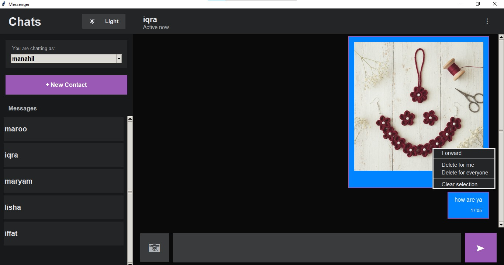

# 💬 IPC Chat System — WhatsApp-Style Desktop Messenger

A WhatsApp-inspired desktop chat application built with Python and Tkinter, developed as part of an Operating Systems course to demonstrate Inter-Process Communication (IPC) concepts including message passing, shared memory, and process synchronization.

## 📸 Screenshot



## ✨ Features

- 👥 Multiple contacts with switchable "I am" user selector
- 💬 Real-time text messaging with chat bubbles and timestamps
- 🖼️ Image sharing support (PNG, JPG, GIF)
- ↗️ Message forwarding with metadata tagging
- 🗑️ Delete for me / Delete for everyone
- ✅ Multi-select messages for bulk delete or forward
- 🚫 Block / Unblock contacts
- 🌙 Dark / Light mode toggle
- 🟢 Active now status indicator
- 🔇 Silent message drop for blocked contacts

## 🧠 IPC Concepts Demonstrated

- **Message Passing** — transactional send/receive between user processes
- **Shared Memory** — conversation histories and media caches
- **Process Synchronization** — mutex locks, semaphores, race condition handling
- **Producer-Consumer Pattern** — message queue management
- **Atomic Operations** — delete-for-everyone with consistency guarantees

## 🛠️ Tech Stack

- Python
- Tkinter (GUI)
- Pillow / PIL (image handling)
- Threading & concurrency primitives

## 🚀 How to Run

1. Clone the repo
```bash
   git clone https://github.com/Manahil-debug/IPC-Chat-System.git
```
2. Install dependencies
```bash
   pip install pillow
```
3. Run the app
```bash
   python ipc.py
```

## 📄 Documentation

Full system design documentation covering IPC architecture, data models, security, performance, and scalability is included in the project report.

## 👩‍💻 Author

**Manahil Ramzan** — [GitHub](https://github.com/Manahil-debug)
