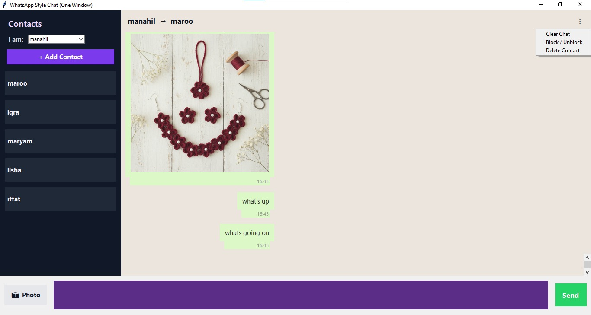

# 💬 IPC Chat System — WhatsApp-Style Desktop Messenger

A WhatsApp-inspired desktop chat application built with Python and Tkinter, developed as part of an Operating Systems course to demonstrate Inter-Process Communication (IPC) concepts.

## 📸 Screenshot



## ✨ Features

- 👥 Multiple contacts with a switchable "I am" user selector
- 💬 Real-time text messaging with chat bubbles and timestamps
- 🖼️ Image sharing support (PNG, JPG, GIF)
- 🚫 Block / Unblock contacts
- 🗑️ Delete contacts and clear chat history
- 🌙 Clean WhatsApp-style UI with dark sidebar

## 🛠️ Tech Stack

- Python
- Tkinter (GUI)
- Pillow / PIL (image handling)
- Threading & IPC concepts

## 🚀 How to Run

1. Clone the repo
```bash
   git clone https://github.com/Manahil-debug/IPC-Chat-System.git
```
2. Install dependencies
```bash
   pip install pillow
```
3. Run the app
```bash
   python ipc.py
```

## 👩‍💻 Author

**Manahil Ramzan** — [GitHub](https://github.com/Manahil-debug)
